## 🔄 Diagrama de Sequência (PlantUML)

<!-- Substitua o link abaixo com a imagem do seu diagrama de sequência -->
### CadastrarItem

---

#### PlantUML Code CadastrarItens

### EditarItens

#### PlantUML Code EditarItens

```plantuml
@startuml
actor FuncionarioGerente

participant "EditarItens" as EditarItens
participant "ComidaDAO" as ComidaDAO
participant "Comida" as Comida
participant "BebidaDAO" as BebidaDAO
participant "Bebida" as Bebida
participant "SobremesaDAO" as SobremesaDAO
participant "Sobremesa" as Sobremesa

== Consulta de Comida ==

FuncionarioGerente -> EditarItens : clica em bntConsultarItem
activate EditarItens
EditarItens -> EditarItens : bntConsultarItemActionPerformed()
EditarItens -> ComidaDAO : buscarPorId(id)
activate ComidaDAO
ComidaDAO --> EditarItens : retorna Comida
deactivate ComidaDAO
EditarItens -> EditarItens : setText nos campos com dados da Comida
deactivate EditarItens

== Atualização de Comida ==

FuncionarioGerente -> EditarItens : clica em btnAtualizarItem
activate EditarItens
EditarItens -> Comida : atualiza Comida com dados dos campos
activate Comida
deactivate Comida
EditarItens -> ComidaDAO : atualizar(comida)
activate ComidaDAO
ComidaDAO --> EditarItens : retorno void
deactivate ComidaDAO
EditarItens -> EditarItens : limpa os campos (setText(""))
deactivate EditarItens

== Consulta de Bebida ==

FuncionarioGerente -> EditarItens : clica em bntConsultarItem
activate EditarItens
EditarItens -> EditarItens : bntConsultarItemActionPerformed()
EditarItens -> BebidaDAO : buscarPorId(id)
activate BebidaDAO
BebidaDAO --> EditarItens : retorna Bebida
deactivate BebidaDAO
EditarItens -> EditarItens : setText nos campos com dados da Bebida
deactivate EditarItens

== Atualização de Bebida ==

FuncionarioGerente -> EditarItens : clica em btnAtualizarItem
activate EditarItens
EditarItens -> Bebida : atualiza Bebida com dados dos campos
activate Bebida
deactivate Bebida
EditarItens -> BebidaDAO : atualizar(bebida)
activate BebidaDAO
BebidaDAO --> EditarItens : retorno void
deactivate BebidaDAO
EditarItens -> EditarItens : limpa os campos (setText(""))
deactivate EditarItens

== Consulta de Sobremesa ==

FuncionarioGerente -> EditarItens : clica em bntConsultarItem
activate EditarItens
EditarItens -> EditarItens : bntConsultarItemActionPerformed()
EditarItens -> SobremesaDAO : buscarPorId(id)
activate SobremesaDAO
SobremesaDAO --> EditarItens : retorna Sobremesa
deactivate SobremesaDAO
EditarItens -> EditarItens : setText nos campos com dados da Sobremesa
deactivate EditarItens

== Atualização de Sobremesa ==

FuncionarioGerente -> EditarItens : clica em btnAtualizarItem
activate EditarItens
EditarItens -> Sobremesa : atualiza Sobremesa com dados dos campos
activate Sobremesa
deactivate Sobremesa
EditarItens -> SobremesaDAO : atualizar(sobremesa)
activate SobremesaDAO
SobremesaDAO --> EditarItens : retorno void
deactivate SobremesaDAO
EditarItens -> EditarItens : limpa os campos (setText(""))
deactivate EditarItens
@enduml
```

### TelaInicialCliente

#### PlantUML Code TelaInicial

```plantuml
@startuml
actor Cliente

Cliente -> TelaInicialCliente : new()
activate TelaInicialCliente
TelaInicialCliente -> TelaInicialCliente : initComponents()

== Acessar o Cardápio ==
Cliente -> TelaInicialCliente : btnCardapioActionPerformed()
TelaInicialCliente -> CardapioCliente : new()
CardapioCliente -> CardapioCliente : setVisible(true)
@enduml
```

### Cardapio

#### PlantUML Code Cardapio

### IniciarPedidos

#### PlantUML Code IniciarPedidos

### VisualizarCarrinho

#### PlantUML Code VisualizarCarrinho

### FecharConta

#### PlantUML Code FecharConta

