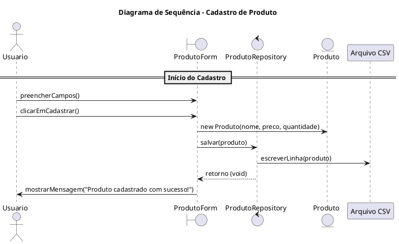

# Sistema de Restaurante com Interface Gráfica <br> (Java Swing + SQL + POO)

Este projeto é um projeto academico desenvolvido para disciplina de **Projeto de Software**, com o objetivo de demonstrar um Sistema de Pedidos para um restaurante, além disso contamos com a interação entre o **Diagrama de Classes** e o **Diagrama de Sequência** do respectivo trabalho.

Iremos abordar diversas funcionalidades com suas respectivas interfaces, junto com seu Diagrama de Classe e Diagrama de Sequência.

---

## ✨ Funcionalidades Funcionário/Gerente

- Cadastro de Itens (Comidas, Bebidas, Sobremesas) com os campos:
  - Tipo de Item
  - Nome
  - Valor
  - Quantidade
  - Estado (Disponivel/Indisponivel)
  - Descrição (para Comidas/Sobremesas)
  - Interface simples com Java Swing
  - Botão de Cadastro do Item

- Editar itens (Comidas, Bebidas, Sobremesas) com os campos:
  - Tipo de Item
  - ID (Informar o ID do Item que quer editar)
  - Mostrar o ID do Item (Informar o ID do Item que quer editar)
  - Mostrar Nome, Valor, Quantidade, Descrição, Estado do Item (seja Comida, Bebida, Sobremesa)
  - Botão de Consulta para consultar com base no ID informado + Tipo de Item
  - Botão de Atualizar após mudar os dados
  
  
---

## 🧱 Estrutura do Projeto

- pkg beans
  - `Comida`: classe modelo que representa a comida
  - `Bebida`: classe modelo que representa a bebida
  - `Sobremesa`: classe modelo que representa a sobremesa
  - `Mesa`: classe modelo que representa a mesa
  - `Pedido`: classe modelo que representa o pedido
  
- pkg DAO
  - `ComidaDAO`: responsável por conter os métodos com os seus respectivos comandos SQL e estabelecer a conexão com o BD
  - `BebidaDAO`: responsável por conter os métodos com os seus respectivos comandos SQL e estabelecer a conexão com o BD
  - `SobremesaDAO`: responsável por conter os métodos com os seus respectivos comandos SQL e estabelecer a conexão com o BD
  - `MesaDAO`: responsável por conter os métodos com os seus respectivos comandos SQL e estabelecer a conexão com o BD
  - `PedidosDAO`: responsável por conter os métodos com os seus respectivos comandos SQL e estabelecer a conexão com o BD
    
- pkg interfaces (Parte do Funcionario/Gerente)
  - `CadastrarItens`: interface gráfica para cadastro de Itens
  - `EditarItens`: interface gráfica para editar os Itens

- pkg conexao (Parte do Cliente)
  - `TelaInicial`: interface gráfica com a tela inicial do sistema
  - `Cardapio`: interface gráfica para visualizar o cardápio
  - `IniciarPedidos`: interface gráfica para enviar pedidos para o carrinho
  - `VisualizarCarrinho`: interface gráfica para visualizar os pedidos do carrinho e confirmá-los
  - `FecharConta`: interface gráfica para visualizar o valor total da conta e fechá-la

- pkg conexao 
  - `Conexao`: classe responsável por estabelecer a conexão com o Banco de Dados

---

## ➡️ Diagrama de Caso de Uso


## 📘 Diagrama de Classes

<!-- Substitua o link abaixo com a imagem do seu diagrama de classes -->
### Astah 
## ➝ Cadastro de Itens / Edição Itens - Interfaces


## ➝ Conexão com Banco de Dados - Classe


---

## 🔄 Diagrama de Sequência (ainda falta)

<!-- Substitua o link abaixo com a imagem do seu diagrama de sequência -->
### Astah


---

### PlantUML


---

#### PlantUML – code



## 🧠 Objetivos do Projeto

- Demonstrar o sistema e suas funcionalidades
- Mostrar os diagramas do projeto (Caso de Uso, Classe, Sequência)
- Trabalhar com Banco de Dados e Organização de pedidos.
- Desenvolver interfaces gráficas com Swing e trabalhar lógica de POO com SQL

---

## 📂 Organização dos Arquivos

```
SistemaRestaurante/
├── ProjetoSistemaRestaurante/
│   ├── src/
│   │   └── DAO/
│   │   │     ├── ComidaDAO.java
│   │   │     ├── BebidaDAO.java
│   │   │     ├── SobremesaDAO.java      
│   │   │     ├── MesaDAO.java         
│   │   │     ├── PedidosDAO.java              
│   │   │                    
│   │   └── beans/
│   │   │     ├── Comida.java 
│   │   │     ├── Bebida.java 
│   │   │     ├── Sobremesa.java
│   │   │     ├── Pedido.java
│   │   │     ├── Mesa.java
│   │   │
│   │   └── interfaces/
│   │   │     ├── CadastrarItens.java 
│   │   │     ├── CadastrarItens.form 
│   │   │     ├── Cardapio.java 
│   │   │     ├── Cardapio.form
│   │   │     ├── EditarItens.java 
│   │   │     ├── EditarItens.form 
│   │   │     ├── IniciarPedidos.java 
│   │   │     ├── IniciarPedidos.form 
│   │   │     ├── VisualizarCarrinho.java
│   │   │     ├── VisualizarCarrinho.form
│   │   │
│   │   └── conexao/
│   │   │     ├── Conexao.java
│   │   │
│   │   └── Imagens/
│   │              
│   │
│   └── notinhaConta.csv
│
│
└── DescricaoNumerada.md
└── BancoDeDadosSistemaRestaurante.sql
└── DiagramaDeCasoDeUso.asta
└── mysql-connector-j-8.1.0.jar
│
├── LICENSE
└── README.md
```

---

### 🗂️ Descrição dos Diretórios e Arquivos

- **`Produto.java`**: Classe que representa o modelo de dados.
- **`ProdutoForm.java`**: Interface gráfica (Swing) para entrada de dados.
- **`ProdutoRepository.java`**: Responsável por salvar e carregar produtos do arquivo CSV.
- **`produtos.csv`**: Arquivo onde os dados são persistidos.
- **`LICENSE`**: Arquivo de licença MIT.
- **`README.md`**: Este arquivo com instruções e explicações do projeto.

---

## 🧩 Desafio

Como exercício complementar, **projete e implemente as demais funcionalidades do CRUD (Create, Read, Update, Delete)** para produtos:

- 📖 **Listar Produtos**: Leia e exiba todos os produtos cadastrados no CSV.
- ✏️ **Atualizar Produto**: Permita alterar as informações de um produto existente.
- ❌ **Excluir Produto**: Implemente uma forma de apagar um produto do CSV.

> 💡 Lembre-se de adaptar o repositório e a interface gráfica para essas operações, sempre mantendo a separação entre lógica de apresentação e acesso a dados.

---


## 📄 Licença

Este projeto está licenciado sob os termos da licença MIT.  
Consulte o arquivo [LICENSE](LICENSE) para mais informações.

---
---

## 👤 Autor

**Prof. Herysson R. Figueredo**  
Curso de Ciência da Computação – Universidade Franciscana (UFN)

📧 E-mail: herysson.figueiredo@ufn.edu.br  
🔗 GitHub: [@Herysson](https://github.com/Herysson)  


