# Sistema de Restaurante com Interface Gráfica <br> (Java Swing + SQL + POO)

Este projeto é um projeto academico desenvolvido para disciplina de **Projeto de Software**, com o objetivo de demonstrar um Sistema de Pedidos para um restaurante, além disso contamos com a interação entre o **Diagrama de Classes** e o **Diagrama de Sequência** do respectivo trabalho.

Iremos abordar diversas funcionalidades com suas respectivas interfaces, junto com seu Diagrama de Classe e Diagrama de Sequência.

---

## ✨ Funcionalidades Funcionário/Gerente

- Cadastro de Itens (Comidas, Bebidas, Sobremesas) com os campos:
  - Tipo de Item
  - Nome
  - Valor
  - Quantidade
  - Estado (Disponivel/Indisponivel)
  - Descrição (para Comidas/Sobremesas)
  - Interface simples com Java Swing
  - Botão de Cadastro do Item

- Editar itens (Comidas, Bebidas, Sobremesas) com os campos:
  - Tipo de Item
  - ID (Informar o ID do Item que quer editar)
  - Mostrar o ID do Item (Informar o ID do Item que quer editar)
  - Mostrar Nome, Valor, Quantidade, Descrição, Estado do Item (seja Comida, Bebida, Sobremesa)
  - Botão de Consulta para consultar com base no ID informado + Tipo de Item
  - Botão de Atualizar após mudar os dados
  
  
---

## 🧱 Estrutura do Projeto

- pkg beans
  - `Comida`: classe modelo que representa a comida
  - `Bebida`: classe modelo que representa a bebida
  - `Sobremesa`: classe modelo que representa a sobremesa
  - `Mesa`: classe modelo que representa a mesa
  - `Pedido`: classe modelo que representa o pedido
  
- pkg DAO
  - `ComidaDAO`: responsável por conter os métodos com os seus respectivos comandos SQL e estabelecer a conexão com o BD
  - `BebidaDAO`: responsável por conter os métodos com os seus respectivos comandos SQL e estabelecer a conexão com o BD
  - `SobremesaDAO`: responsável por conter os métodos com os seus respectivos comandos SQL e estabelecer a conexão com o BD
  - `MesaDAO`: responsável por conter os métodos com os seus respectivos comandos SQL e estabelecer a conexão com o BD
  - `PedidosDAO`: responsável por conter os métodos com os seus respectivos comandos SQL e estabelecer a conexão com o BD
    
- pkg interfaces (Parte do Funcionario/Gerente)
  - `CadastrarItens`: interface gráfica para cadastro de Itens
  - `EditarItens`: interface gráfica para editar os Itens

- pkg conexao (Parte do Cliente)
  - `TelaInicial`: interface gráfica com a tela inicial do sistema
  - `Cardapio`: interface gráfica para visualizar o cardápio
  - `IniciarPedidos`: interface gráfica para enviar pedidos para o carrinho
  - `VisualizarCarrinho`: interface gráfica para visualizar os pedidos do carrinho e confirmá-los
  - `FecharConta`: interface gráfica para visualizar o valor total da conta e fechá-la

- pkg conexao 
  - `Conexao`: classe responsável por estabelecer a conexão com o Banco de Dados

---

## ➡️ Diagrama de Caso de Uso


## 📘 Diagrama de Classes

### Astah

## ➝ CadastrarItens / EditarItens - Classes de Interfaces (Uso do Funcionario/Gerente)


## ➝ Conexão com Banco de Dados - Classe de Conexao


## ➝ DAO(Repository) - Classes para passar comandos SQL


## ➝ TelaInicial - Classe de Interface (Uso do Cliente)


## ➝ Cardapio - Classe de Interface (Uso do Cliente)


## ➝ IniciarPedidos - Classe de Interface (Uso do Cliente) 


## ➝ VisualizarCarrinhoCliente - Classe de Interface (Uso do Cliente)


## ➝ FecharConta - Classe de Interface (Uso do Cliente)


---

## 🔄 Diagrama de Sequência (ainda falta)

<!-- Substitua o link abaixo com a imagem do seu diagrama de sequência -->
### Astah


---

### PlantUML


---

#### PlantUML – code

```plantuml
@startuml
title Diagrama de Sequência - Cadastro de Produto

actor Usuario

boundary ProdutoForm
control ProdutoRepository
entity Produto

== Início do Cadastro ==

Usuario -> ProdutoForm : preencherCampos()
Usuario -> ProdutoForm : clicarEmCadastrar()

ProdutoForm -> Produto : new Produto(nome, preco, quantidade)

ProdutoForm -> ProdutoRepository : salvar(produto)

ProdutoRepository -> "Arquivo CSV" : escreverLinha(produto)

ProdutoRepository --> ProdutoForm : retorno (void)

ProdutoForm -> Usuario : mostrarMensagem("Produto cadastrado com sucesso!")

@enduml
```



## 🧠 Objetivos do Projeto

- Demonstrar o sistema e suas funcionalidades
- Mostrar os diagramas do projeto (Caso de Uso, Classe, Sequência)
- Trabalhar com Banco de Dados e Organização de pedidos.
- Desenvolver interfaces gráficas com Swing e trabalhar lógica de POO com SQL

---

## 📂 Organização dos Arquivos

```
SistemaRestaurante/
├── ProjetoSistemaRestaurante/
│   ├── src/
│   │   └── DAO/
│   │   │     ├── ComidaDAO.java
│   │   │     ├── BebidaDAO.java
│   │   │     ├── SobremesaDAO.java      
│   │   │     ├── MesaDAO.java         
│   │   │     ├── PedidosDAO.java              
│   │   │                    
│   │   └── beans/
│   │   │     ├── Comida.java 
│   │   │     ├── Bebida.java 
│   │   │     ├── Sobremesa.java
│   │   │     ├── Pedido.java
│   │   │     ├── Mesa.java
│   │   │
│   │   └── interfaces/
│   │   │     ├── CadastrarItens.java 
│   │   │     ├── CadastrarItens.form 
│   │   │     ├── Cardapio.java 
│   │   │     ├── Cardapio.form
│   │   │     ├── EditarItens.java 
│   │   │     ├── EditarItens.form 
│   │   │     ├── IniciarPedidos.java 
│   │   │     ├── IniciarPedidos.form 
│   │   │     ├── VisualizarCarrinho.java
│   │   │     ├── VisualizarCarrinho.form
│   │   │
│   │   └── conexao/
│   │   │     ├── Conexao.java
│   │   │
│   │   └── Imagens/
│   │              
│   │
│   └── notinhaConta.csv
│
│
└── Diagramas/
│          ├── CasoDeUso.md
│          ├── DescriçãoNumerada.md
│          ├── DiagramasDeClasses.md
│
└── BancoDeDadosSistemaRestaurante.sql
└── mysql-connector-j-8.1.0.jar
│
├── LICENSE
└── README.md
```

---

### 🗂️ Descrição dos Diretórios e Arquivos

- **`DAO/`**: Pasta que armazena as classes responsáveis pelos métodos específicos com comandos SQL.
- **`beans/`**: Pasta que armazena as classes com seus atributos e métodos (models)
- **`interfaces/`**: Pasta que armazena as interfaces gráficas (forms) do sistema.
- **`conexao/`**: Pasta responsável por armazenar a classe Conexao.java que faz a conexão do sistema com o BD
- **`Imagens/`**: Pasta responsável por armazenar as imagens utilizadas na implementação da interface gráfica do sistema
- **`notinhaConta.csv`**: Arquivo onde a notinha com valor total é persistida.
- **`Diagramas/`**: Pasta responsável por armazenar os diagramas
- **`BancoDeDadosSistemaRestaurante.sql`**: Arquivo.sql que contém o Banco de Dados criado no MYSQL
- **`mysql-connector-j-8.1.0.jar`**: Arquivo.jar que contém a biblioteca que utilizamos para utilizar as funções para criar a conexão com o BD
- **`LICENSE`**: Arquivo de licença MIT.
- **`README.md`**: Este arquivo com instruções e explicações do projeto.

---

## 📄 Licença

Este projeto está licenciado sob os termos da licença MIT.  
Consulte o arquivo [LICENSE](LICENSE) para mais informações.

---
---

## 👤 Autores

**Matheus Nogueira Albuquerque**  
Curso de Ciência da Computação – Universidade Franciscana (UFN)

📧 E-mail: matheus.nalbuquerque@ufn.edu.br

🔗 GitHub: [@Matheus](https://github.com/Nogz04) 

---

**Romeo Noro Guterres**  
Curso de Ciência da Computação – Universidade Franciscana (UFN)

📧 E-mail: romeo.noro@ufn.edu.br 

🔗 GitHub: [@Romeo](https://github.com/romeonoro) 


---

**Gilberto Morales**  
Curso de Ciência da Computação – Universidade Franciscana (UFN)

📧 E-mail: g.morales@ufn.edu.br  

🔗 GitHub: [@Gilberto](https://github.com/eumorales) 
 


